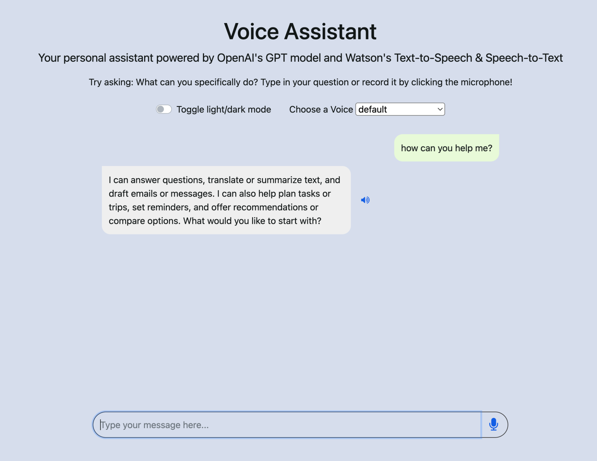

# 🎙️ Voice Assistant Web App

A full-stack voice-enabled assistant built with **Flask**, **IBM Watson
(Speech-to-Text & Text-to-Speech)**, and **OpenAI GPT**.

This application allows users to: - 🎤 Record speech and transcribe it
to text - 🤖 Generate AI-powered responses using OpenAI - 🔊 Convert
responses back to speech - 💬 Interact through a clean chat-style
interface

------------------------------------------------------------------------

## 📸 Application Preview



------------------------------------------------------------------------

## 🏗️ Architecture Overview

**Workflow:**

1.  User records audio in the browser\
2.  Audio is sent to IBM Watson Speech-to-Text (lab endpoint)\
3.  Transcribed text is sent to OpenAI GPT\
4.  AI response text is generated\
5.  Response is converted to speech via Watson Text-to-Speech\
6.  Text + audio (base64) are returned to the frontend

------------------------------------------------------------------------

## 📁 Project Structure

    ├── server.py              # Flask routes and API endpoints
    ├── worker.py              # Watson + OpenAI logic
    ├── templates/
    │   └── index.html         # Frontend UI
    ├── static/
    │   ├── script.js          # Client-side logic
    │   └── style.css          # Styling
    ├── requirements.txt       # Python dependencies
    ├── Dockerfile             # Container configuration
    └── README.md

------------------------------------------------------------------------

## 🚀 Running Locally

### 1️⃣ Clone the repository

    git clone <your-repo-url>
    cd <your-project-folder>

### 2️⃣ Install dependencies

    pip install -r requirements.txt

### 3️⃣ Set your OpenAI API key

**macOS / Linux**

    export OPENAI_API_KEY="YOUR_API_KEY"

**Windows (PowerShell)**

    setx OPENAI_API_KEY "YOUR_API_KEY"

### 4️⃣ Start the server

    python server.py

Open in your browser:

    http://localhost:8000

------------------------------------------------------------------------

## 🐳 Run with Docker

Build:

    docker build -t voice-assistant .

Run:

    docker run -p 8000:8000 -e OPENAI_API_KEY="YOUR_API_KEY" voice-assistant

------------------------------------------------------------------------

## 🔌 API Endpoints

### POST `/speech-to-text`

-   Accepts raw audio bytes
-   Returns:

``` json
{"text": "transcribed text"}
```

### POST `/process-message`

Request:

``` json
{"userMessage": "Hello", "voice": "default"}
```

Response:

``` json
{
  "openaiResponseText": "Assistant reply",
  "openaiResponseSpeech": "<base64 encoded wav>"
}
```

------------------------------------------------------------------------

## ⚠️ Important Notes

-   The Watson endpoints used (`sn-watson-*.labs.skills.network`) are
    **lab-specific** and may not work outside the IBM Skills Network
    environment unless replaced with standard IBM Cloud credentials.
-   OpenAI requires a valid API key.
-   Never commit API keys or certificates to GitHub.
-   Server `print()` logs appear in the terminal or Docker logs, not in
    the browser.

------------------------------------------------------------------------

## 🔐 Security Best Practices

-   Use environment variables for secrets
-   Add sensitive folders (e.g., `certs/`) to `.gitignore`
-   Do not hardcode credentials

------------------------------------------------------------------------

## 📄 License

MIT License
